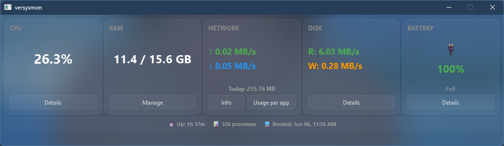

# Versysmon

A system monitor for Windows that covers the gaps Task Manager leaves open — per-app bandwidth tracking, memory pressure management, and hardware diagnostics, all in one place.



---

## What it does

**CPU & RAM**
- Overall CPU load + per-core breakdown, alongside full hardware specs.
- RAM split into Used, Cached (Standby), and Free — not just a single bar.
- Lists the top memory hogs and lets you kill them directly from the UI.
- *Memory Reduct*: calls Windows' `EmptyWorkingSet` API to flush idle background processes out of RAM without terminating them.

**Network**
- Live global upload/download speeds.
- Tracks which apps are making network connections and logs their daily and monthly data usage to a local SQLite database (`versysmon_data.db`).
- Set per-app data caps; get a warning when you're close to the limit.

**Storage & Battery**
- Real-time disk read/write speeds with a per-partition breakdown.
- Battery details pulled via WMI: chemistry, voltage, power status, and estimated time remaining.

**UI**
- Acrylic blur window, system tray support so it can run in the background, and native Windows styling via `pywinstyles`.

---

## Installation

### Executable (easiest)
Download `Versysmon.exe` from the [Releases](https://github.com/charizawrd/versysmon/releases) page and run it — no install needed.

### From source

```bash
git clone https://github.com/charizawrd/versysmon.git
cd versysmon
pip install PyQt6 psutil py-cpuinfo pywinstyles
python main.py
```

Requires Python 3.8+. The memory cleaner and per-app network tracking need Administrator privileges to work correctly.

---

## Project layout

| File | What it does |
|---|---|
| `main.py` | UI, page routing, animations |
| `sys_logic.py` | CPU, RAM, disk, battery — via `psutil` and `subprocess` |
| `net_logic.py` | Background thread for live speeds and per-app socket tracking |
| `db_logic.py` | SQLite read/write for historical network usage |
| `styles.py` | Global Qt stylesheet |

---

## License

MIT.
